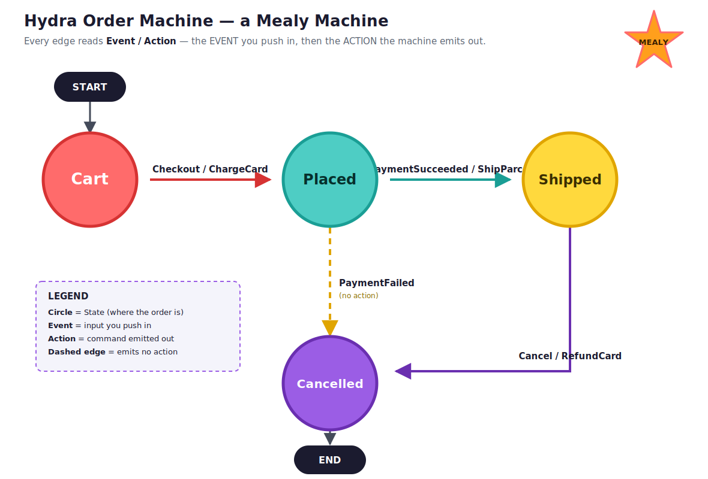

= Hydra 🐙
Gopal S Akshintala <gopalakshintala@gmail.com>
:Revision: 1.0
ifdef::env-github[]
:tip-caption: :bulb:
:note-caption: :information_source:
:important-caption: :heavy_exclamation_mark:
:caution-caption: :fire:
:warning-caption: :warning:
endif::[]
:hide-uri-scheme:
:toc:
:toc-placement: preamble
:testdir: src/test/java
:prewrap!:

image:https://img.shields.io/maven-central/v/com.salesforce.hydra/hydra?label=Maven%20Central[Maven Central,link=https://repo1.maven.org/maven2/com/salesforce/hydra/hydra/]
image:https://img.shields.io/badge/License-Apache_2.0-blue.svg[License: Apache 2.0,link=LICENSE]
image:https://img.shields.io/badge/JDK-21%2B-orange.svg[JDK 21+]
image:https://img.shields.io/badge/Kotlin-%E2%9C%93-7F52FF.svg[Kotlin]
image:https://img.shields.io/badge/Docs-Antora-1A9E95.svg[Documentation,link=https://salesforce-misc.github.io/Hydra/hydra/index.html]

____
States, Events, Actions
____

**Hydra** is a tiny, thread-safe, type-safe library that exposes a fluent DSL for building *finite state machines* on the JVM — usable from both Java and Kotlin. You declare the states your system can be in, the events that move it between them, and Hydra gives you a machine that makes only the *legal* moves, models every outcome as a type, and notifies listeners as it goes.

It is small enough to read in one sitting, yet built for the demanding case: **driving long-running, asynchronous orchestrators** where steps complete on different threads or hosts minutes apart, and the durable truth lives outside the JVM. That second use case is why Hydra exists — see <<Driving asynchronous orchestrators>>.

[TIP]
====
*📖 Full documentation: https://salesforce-misc.github.io/Hydra/hydra/index.html*

The sections below are a quick start. Every concept has a focused page on the docs site.
====

== Why a state machine?

Think of a state machine as a **subway map**:

* **Stations** are *states* — the discrete places the system can be (`Cart`, `Placed`, `Shipped`).
* **Turnstiles between stations** are *events* — you cannot teleport from any station to any other; you may only take the connections the map allows.
* A **transition** is one ride through one turnstile: it either *works* (you arrive at the next station), or it is *not allowed* (you pushed a turnstile that does not exist here), or there is *no such station* on this map at all.

Modelling a workflow this way — instead of a tangle of `if`/`else` and callbacks — buys you three things that matter at scale:

1. **The legal moves are explicit.** Illegal transitions are rejected by construction, not discovered at runtime.
2. **Failures are *types*, not nulls or booleans.** Every push returns a sealed `Transition` — `Valid`, `Invalid`, or `NoFromState` — so the caller is *forced* to handle "this can't happen" rather than silently ignoring it.
3. **Durable resume.** Because the position is an explicit value, a run that dies mid-flight knows exactly which step it was at and can resume from there.

== Features

* **Type-safe generics** — `Hydra<StateT, EventT, ActionT>`. States, events, and the optional action payload are all your own types; the compiler keeps them straight.
* **Thread-safe by design** — the current state lives in a single `AtomicReference`, and each `transition` does a `synchronized` match-and-move. Safe to drive from many concurrent worker threads; the state never tears.
* **Sealed `Transition` outcomes** — `Valid(fromState, event, toState, action)` / `Invalid(fromState, event)` / `NoFromState(event)`. Three honest results, exhaustively handled.
* **Lifecycle listeners** — register `onEnter`, `onExit`, and `onTransition` hooks to fire side effects (logging, metrics, persistence) as the machine moves.
* **Read-only transitions** — compute *what the next move would be* and fire listeners **without** mutating in-memory state. The key enabler for async orchestration (see below).
* **Flexible matching** — match an event/state by value (`eq`), by type (`any(Class)`), or by an arbitrary predicate (`where { … }`).
* **Immutable rebuilds** — `cloneWith { … }` derives a new machine from an existing one (e.g. with a different initial state) without mutating the original.
* **Java- and Kotlin-friendly** — every builder hook has both a Java `Consumer`/`BiConsumer` overload and a Kotlin lambda-with-receiver overload.

== Install

Hydra is published to Maven Central as `com.salesforce.hydra:hydra`.

[source,kotlin,subs="attributes"]
.build.gradle.kts
----
dependencies {
    implementation("com.salesforce.hydra:hydra:0.1.1")
}
----

[source,groovy,subs="attributes"]
.build.gradle
----
dependencies {
    implementation 'com.salesforce.hydra:hydra:0.1.1'
}
----

[source,xml,subs="attributes"]
.pom.xml
----
<dependency>
  <groupId>com.salesforce.hydra</groupId>
  <artifactId>hydra</artifactId>
  <version>0.1.1</version>
</dependency>
----

NOTE: Requires **JDK 21+**.

== Core concepts: State, Event, Action

A Hydra machine is a https://en.wikipedia.org/wiki/Mealy_machine[**Mealy machine**] — and the three type parameters of `Hydra<StateT, EventT, ActionT>` are its three independent vocabularies. The single most important thing to internalise is that **Event and Action sit on opposite ends of a transition**:

[cols="1,1,4",options="header"]
|===
| Concept | Direction | What it is
| **State** | — | *Where* the machine is. A discrete position, held one at a time. May carry context (e.g. `Placed(amount, address)`).
| **Event** | **input** ↓ | Something that happened *to* the machine — the **cause**. You *push* it in. Often a bare signal (`PaymentSucceeded`).
| **Action** | **output** ↑ | A command the machine *emits* on a transition — the **effect**. You *receive* it. Carries the data the doer needs (`ShipParcel(address)`).
|===

You **push Events in** and **receive Actions out** — never the reverse. Because they are distinct types, the compiler enforces that one-way arrow: `transition(event)` will not accept an `Action`. (See <<Why are Event and Action different types?>>.)

== Quick start: an Order machine

Model the lifecycle of an order. Each edge reads **`Event / Action`** — the event that drives the move, then the action emitted on it (a *dashed* edge emits no action):

Three distinct type families — `State`, `Event`, `Action` — modelled as sealed interfaces of records (JDK 21):

[source,java,indent=0,options="nowrap"]
----
sealed interface OrderState {}
record Cart()                                  implements OrderState {}
record Placed(long amountCents, String address) implements OrderState {}
record Shipped(long amountCents, String address) implements OrderState {}
record Cancelled()                             implements OrderState {}

sealed interface OrderEvent {}                                 // INPUTS — what happened to us
record Checkout(long amountCents, String address) implements OrderEvent {}
record PaymentSucceeded()           implements OrderEvent {}   // a bare signal — no data
record PaymentFailed(String reason) implements OrderEvent {}
record Cancel()                     implements OrderEvent {}

sealed interface OrderAction {}                                // OUTPUTS — commands we emit
record ChargeCard(long amountCents) implements OrderAction {}
record ShipParcel(String address)   implements OrderAction {}
record RefundCard(long amountCents) implements OrderAction {}
----

Weave them into a machine. Each `sb.on(Event.class, …)` declares an edge; `sb.transitionTo(nextState, action)` says where to go and what to emit:

[source,java,indent=0,options="nowrap"]
----
Hydra<OrderState, OrderEvent, OrderAction> orderMachine = Hydra.create(mb -> {
  mb.initialState(new Cart());

  mb.state(Cart.class, sb ->
      sb.on(Checkout.class, (cart, checkout) ->
          sb.transitionTo(
              new Placed(checkout.amountCents(), checkout.address()),  // next STATE
              new ChargeCard(checkout.amountCents()))));               // ACTION emitted

  mb.state(Placed.class, sb -> {
    sb.onExit(onPlacedExit);                                           // listener: leaving Placed
    // ★ The Mealy point: a BARE event in, a data-carrying action out.
    //   PaymentSucceeded has no payload; ShipParcel's address comes from the STATE.
    sb.on(PaymentSucceeded.class, (placed, event) ->
        sb.transitionTo(
            new Shipped(placed.amountCents(), placed.address()),
            new ShipParcel(placed.address())));
    // A transition may emit NO action — the payload is optional.
    sb.on(PaymentFailed.class, (placed, event) -> sb.transitionTo(new Cancelled()));
  });

  mb.state(Shipped.class, sb -> {
    sb.onEnter(onShippedEnter);                                        // listener: arriving at Shipped
    sb.on(Cancel.class, (shipped, event) ->
        sb.transitionTo(new Cancelled(), new RefundCard(shipped.amountCents())));
  });

  mb.state(Cancelled.class, sb -> {});                                 // terminal — no outgoing edges
});
----

Drive it by pushing **events**. Each valid push moves the state *and* hands you an **action** — which you then carry out by calling your own code (here, a payment gateway and a warehouse):

[source,java,indent=0,options="nowrap"]
----
// 1. Push an event. The machine moves AND tells you what to do next.
var checkout = orderMachine.transition(new Checkout(4999, "1 Market St"));
orderMachine.getState();                              // Placed[amountCents=4999, address=1 Market St]

// 2. Do something with the emitted action — call your own code.
var action = ((Transition.Valid<OrderState, OrderEvent, OrderAction>) checkout).getAction();
switch (action) {
  case ChargeCard c -> paymentGateway.charge(c.amountCents());   // ← ChargeCard[4999] → real charge
  case ShipParcel s -> warehouse.dispatch(s.address());
  case RefundCard r -> paymentGateway.refund(r.amountCents());
}

// Next event: a bare PaymentSucceeded comes back in, ShipParcel goes out → warehouse.dispatch(...)
var paid = orderMachine.transition(new PaymentSucceeded());

// An illegal push is rejected; the state is left untouched and there is no action to run.
var bad = orderMachine.transition(new Cancel());      // from Cart, Cancel isn't a legal move
bad.isValid();                                        // false — Transition.Invalid
----

The `switch` is how you *consume* an action — the detail this glosses is covered next.

The runnable version, with listener and payload assertions, lives in the tests:

* link:{testdir}/com/salesforce/hydra/OrderDomain.java[`OrderDomain.java`] — the `State` / `Event` / `Action` type families above.
* link:{testdir}/com/salesforce/hydra/HydraTest.java[`HydraTest.java`] — the machine wired up, asserting the emitted actions (incl. the bare-event → data-action edge), the optional no-action transition, listeners, and invalid-transition rejection.

== Handling actions

**This is the part to get right: Hydra does not perform actions — it only *hands them to you*.** An `Action` is a plain value, a *command* describing an effect ("charge €49.99"). Hydra computes which command a transition emits; *you* interpret it and do the real-world work. That separation is deliberate — it keeps the machine pure (no I/O, no blocking) and lets you perform the effect wherever and whenever you like (inline, on another thread, after a durable enqueue).

There are two places to consume an action; pick by *when* you need it.

=== 1. Pull it from the returned `Transition` (synchronous, at the call site)

The driver gets the action back and dispatches it. Because `OrderAction` is a **sealed** type, an exhaustive `switch` needs no `default` — add a new action variant later and the compiler flags every `switch` that forgot it:

[source,java,indent=0,options="nowrap"]
----
var transition = orderMachine.transition(new Checkout(4999, "1 Market St"));

if (transition instanceof Transition.Valid<OrderState, OrderEvent, OrderAction> valid) {
  perform(valid.getAction());   // Hydra handed us the command; WE perform it
}

// Interpret the command and do the real work. Exhaustive over the sealed OrderAction.
void perform(OrderAction action) {
  switch (action) {
    case ChargeCard c -> paymentGateway.charge(c.amountCents());
    case ShipParcel s -> warehouse.dispatch(s.address());
    case RefundCard r -> paymentGateway.refund(r.amountCents());
  }
}
----

That `Checkout` push moves the order to `Placed` *and* returns `ChargeCard(4999)`; `perform(...)` is what actually calls the payment gateway. Hydra never touched the gateway — see `testDispatchActionPerformsSideEffect` in the tests.

=== 2. React to it in a listener (decoupled, fire-and-forget)

If the *same* effect should run no matter which edge produced the move, register an `onTransition` listener once instead of dispatching at every call site. Listeners receive the whole `Transition`, action included:

[source,java,indent=0,options="nowrap"]
----
mb.onTransition(t -> {
  if (t instanceof Transition.Valid<OrderState, OrderEvent, OrderAction> v && v.getAction() != null) {
    perform(v.getAction());           // central side-effect sink
  }
});
----

Use `onEnter` / `onExit` when the effect depends on the *state* reached rather than the action (Moore-style — e.g. "whenever we arrive at `Shipped`, send the confirmation email").

TIP: For an **asynchronous orchestrator**, you usually don't perform the effect inline at all — you treat the action as a *job to enqueue*, hand it to a worker, and let that worker run it and report back. Same "Hydra emits, you dispatch" split, just across a queue. See <<Driving asynchronous orchestrators>>.

== API guide

=== Building a machine

`Hydra.create(...)` takes a builder lambda. Inside it:

[cols="1,3",options="header"]
|===
| Builder call | Purpose
| `mb.initialState(s)` | The state the machine starts in (required).
| `mb.state(value, Class, sb -> …)` | Declare a state matched by *value equality*.
| `mb.state(Class, sb -> …)` | Declare a state matched by *type*.
| `mb.onTransition(listener)` | A machine-wide listener fired on every transition.
|===

Inside a state builder (`sb`):

[cols="1,3",options="header"]
|===
| Builder call | Purpose
| `sb.on(event, Class, (state, event) -> …)` | A transition triggered by an event matched by value.
| `sb.on(Class, (state, event) -> …)` | A transition triggered by an event matched by type.
| `sb.transitionTo(state[, action])` | Move to `state`, optionally carrying an `action` payload.
| `sb.dontTransition([action])` | Stay in the current state (a self-loop), optionally emitting an action.
| `sb.onEnter(listener)` / `sb.onExit(listener)` | Fire side effects when the state is entered / exited.
|===

=== Driving a machine

[cols="1,3",options="header"]
|===
| Method | Behaviour
| `transition(event)` | Match-and-move. **Mutates** the current state (thread-safe), fires listeners, returns the `Transition`.
| `readTransitionAndNotifyListeners(fromStateClass, fromState, event)` | Computes the move and fires listeners **without mutating** in-memory state. See below.
| `getState()` / `state` | The current state.
| `cloneWith { mb -> … }` | A new machine derived from this one (e.g. a different initial state); the original is untouched.
|===

=== The `Transition` type

Every push returns one of exactly three sealed cases:

[source,kotlin,indent=0,options="nowrap"]
----
sealed class Transition<StateT, EventT, ActionT> {
  data class Valid(fromState, event, toState, action)  // the turnstile opened
  data class Invalid(fromState, event)                 // not a legal move from here
  data class NoFromState(event)                        // no definition for this state
  val isValid get() = this is Valid
}
----

Because the failure modes are *types*, your orchestration logic becomes a total `switch`/`when` over the three cases — the compiler reminds you to handle each.

== Why are Event and Action different types?

It is tempting to think an Event and an Action are the same kind of thing — both are "stuff that happens around a transition." They are not, and conflating them is the most common source of confusion. They are opposite ends of one edge:

[cols="1,1",options="header"]
|===
| Event | Action
| **Input** — arrives from the outside world. | **Output** — emitted by the machine.
| You *push* it: `machine.transition(event)`. | You *receive* it: `transition.getAction()`.
| The **cause** ("payment succeeded"). | The **effect** ("charge the card", "ship the parcel").
| Often a bare signal with no data. | Usually carries data the downstream doer needs.
| Past tense — it already happened. | Imperative — go do this.
|===

A quick test when you are unsure which one you are holding: **ask who produced it.** If the *outside world* produced it (a callback fired, a timer elapsed, a user clicked), it's an Event. If the *machine* produced it as a consequence of moving, it's an Action.

Keeping them as separate type parameters buys real things:

1. **Compile-time direction safety.** `transition(EventT)` cannot accept an `Action`, so you can never accidentally feed an output back in as an input.
2. **Different shapes.** An event like `PaymentSucceeded` is a bare signal; the action it triggers, `ShipParcel(address)`, needs a payload — and that payload often comes from the **State**, not the event (see the ★ edge in the example above). Forcing both into one type would lose that.
3. **Decoupling decision from doing.** The machine *decides* and *emits a command* — it never runs the command itself. Some other code (the call site, a listener, or a worker on another host) interprets the action and *performs* it (see <<Handling actions>>). That separation keeps the machine pure and is what makes the async pattern below possible — the machine never blocks on the side effect.

NOTE: The Action payload is **optional**. A transition that emits nothing — `sb.transitionTo(nextState)` — is perfectly valid (the `PaymentFailed → Cancelled` edge above). If your machine never emits actions, give `ActionT` a wildcard: `Hydra<MyState, MyEvent, ?>`.

== Driving asynchronous orchestrators

A plain `transition(event)` mutating an in-memory `AtomicReference` is perfect for a synchronous, single-process machine. But Hydra was built for the harder case: an **asynchronous orchestrator** whose steps finish on a *different* thread or host, minutes later, and call back to ask "what runs next?"

In that world the JVM's in-memory state is not the source of truth — a database row (or other durable store) is. So Hydra offers `readTransitionAndNotifyListeners(...)`, which answers *"given I just finished step X with exit event E, what is the next step?"* and fires listeners — **without** mutating the in-memory reference. The orchestrator persists the real position; Hydra is consulted as a pure, side-effect-free routing function.

[source,java,indent=0,options="nowrap"]
----
// A worker finishes a step on some host and calls back:
var transition = hydra.readTransitionAndNotifyListeners(
    finishedStep.getClass(), finishedStep, exitEvent);

if (transition.isValid()) {
  var nextStep = ((Transition.Valid<Step, Event, ?>) transition).getToState();
  // dispatch nextStep durably (e.g. enqueue it) and advance the persisted state
} else {
  // Invalid / NoFromState — mark the run failed
}
----

This pattern — **draw the DAG with Hydra, drive it step-by-step with a read-only transition, and keep durable state in your own store** — is exactly how Hydra is used in production at Salesforce to sequence multi-step business pipelines in the **Revenue Cloud / Revenue Lifecycle Management** domain (the `OrderMachine` and `PlaceQuoteMachine` examples nod to that lineage). Hydra stays a small, dependency-light engine; the orchestration, transport, and persistence layers live in the consuming application.

== Documentation

Full docs: https://salesforce-misc.github.io/Hydra/hydra/index.html

Each topic links to its published page. The source for every page lives in `docs/modules/ROOT/pages/<page-name>.adoc` (one concept per file).

[%noheader,cols="1,1",frame=none,grid=none]
|===
| https://salesforce-misc.github.io/Hydra/hydra/index.html[Overview]
| https://salesforce-misc.github.io/Hydra/hydra/why-state-machine.html[Why a State Machine?]

| https://salesforce-misc.github.io/Hydra/hydra/getting-started.html[Getting Started]
| https://salesforce-misc.github.io/Hydra/hydra/core-concepts.html[State, Event & Action]

| https://salesforce-misc.github.io/Hydra/hydra/driving-a-machine.html[Building & Driving]
| https://salesforce-misc.github.io/Hydra/hydra/transition-outcomes.html[Transition Outcomes]

| https://salesforce-misc.github.io/Hydra/hydra/handling-actions.html[Handling Actions]
| https://salesforce-misc.github.io/Hydra/hydra/async-orchestration.html[Async Orchestrators]

| https://salesforce-misc.github.io/Hydra/hydra/event-vs-action.html[Event vs Action]
| https://salesforce-misc.github.io/Hydra/hydra/contributing.html[Contributing]
|===

== Building from source

This is a standard Gradle project with its own wrapper — no local Gradle install needed.

[source,bash]
----
./gradlew build          # full build incl. tests
./gradlew test           # unit tests
./gradlew spotlessApply  # fix code formatting
----

See link:DEVELOPMENT.md[DEVELOPMENT.md] for the full development guide and link:CONTRIBUTING.adoc[CONTRIBUTING] for setup, formatting, versioning, and publishing.

== 🙌🏼 Consume-Collaborate-Contribute

* This link:CONTRIBUTING.adoc[CONTRIBUTING] doc has all the information to set up this library on your local and get hands-on.
* Any issues or PRs are welcome! ♥️

== License

Hydra is licensed under the link:LICENSE[Apache License 2.0]. © 2023 Salesforce, Inc.
